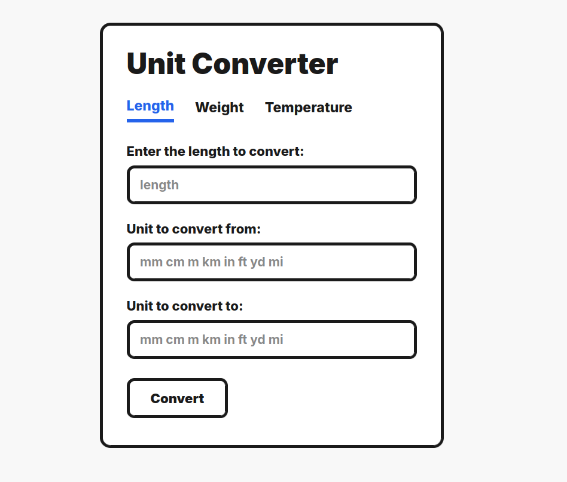
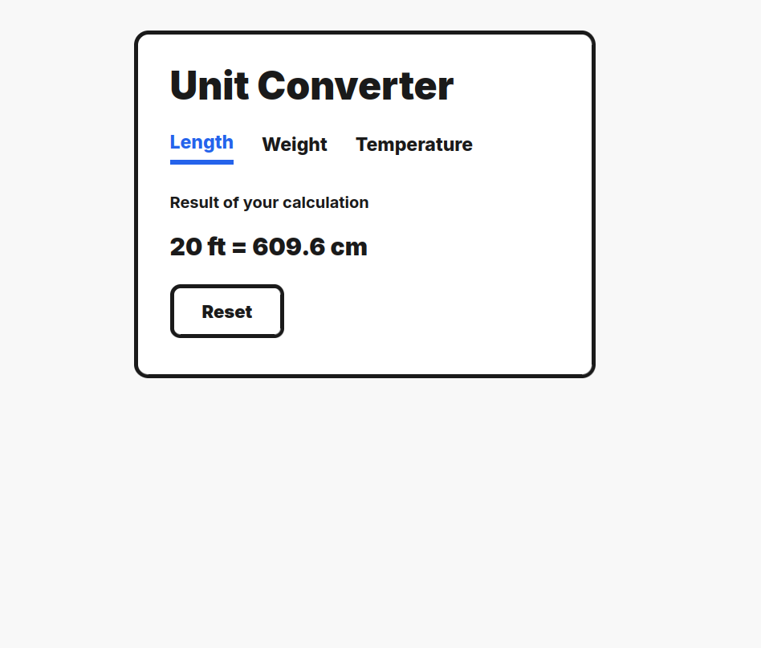

#  Unit Converter

Unit Converter project from [roadmap.sh](https://roadmap.sh/projects/unit-converter) Backend Developer Roadmap. 


## 📝 About the Project

A simple web app that can convert between different units of measurement. It can convert units of length, weight, and temperature. The user can input a value and select the units to convert from and to. The application will then display the converted value.

 


## 🛠️ Built With

[![HTML5][HTML]][HTML-url]
[![CSS3][CSS]][CSS-url]
[![JavaScript][JavaScript]][JavaScript-url]
[![Flask][Flask]][Flask-url]

## 📌 Installation

1. First, clone the repository and cd into the project:
```
git clone https://github.com/syssefim/roadmap.sh-Unit-Converter.git
cd roadmap.sh-Unit-Converter
```
2. Next, install dependencies with this command:
```
pip install -r requirements.txt
```
3. Then, start the app with:
```
python3 app.py
```
4. Finally, open your browser and navigate to [http://127.0.0.1:5000/](http://127.0.0.1:5000/)


---

<div align="center">
  <p>
    Serafim Sharkov • 2026
  </p>
  <p>
    <a href="https://github.com/syssefim">GitHub</a> • 
    <a href="https://www.linkedin.com/in/serafim-sharkov/">LinkedIn</a>
  </p>
</div>

<!-- MARKDOWN LINKS & IMAGES -->
[HTML]: https://img.shields.io/badge/HTML5-E34F26?style=for-the-badge&logo=html5&logoColor=white
[HTML-url]: https://developer.mozilla.org/en-US/docs/Web/HTML
[CSS]: https://img.shields.io/badge/CSS3-1572B6?style=for-the-badge&logo=css3&logoColor=white
[CSS-url]: https://developer.mozilla.org/en-US/docs/Web/CSS
[JavaScript]: https://img.shields.io/badge/JavaScript-F7DF1E?style=for-the-badge&logo=javascript&logoColor=black
[JavaScript-url]: https://developer.mozilla.org/en-US/docs/Web/JavaScript
[Flask]: https://img.shields.io/badge/Flask-000000?style=for-the-badge&logo=flask&logoColor=white
[Flask-url]: https://flask.palletsprojects.com/


